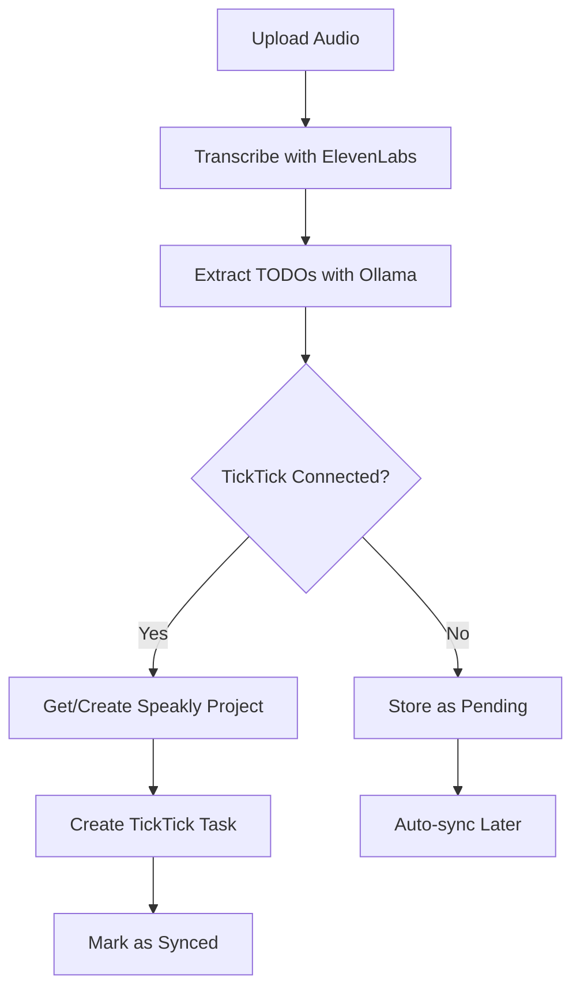

# TickTick Auto-Sync Implementation

## ✅ Auto-Sync Complete!

TODOs extracted from voice sessions now automatically sync to TickTick in a dedicated **"Speakly"** project!

---

## 🎯 How It Works

### **Workflow:**



### **Step-by-Step:**

1. **User uploads audio** → Speakly transcribes it
2. **Ollama extracts TODOs** → Creates TODO records in database
3. **Auto-sync triggers** → Checks if TickTick is connected
4. **Creates/finds "Speakly" project** → Gold-colored project in TickTick
5. **Creates tasks** → Each TODO becomes a task in the Speakly project
6. **Updates sync status** → Tracks which TODOs have been synced

---

## 📦 What Was Implemented

### **1. TickTick Client Extension** (`services/ticktick.py`)

**New Method:**
```python
async def get_or_create_speakly_project() -> str:
    # Looks for existing "Speakly" project
    # Creates it if it doesn't exist (with gold color!)
    # Returns project_id
```

### **2. Sync Service** (`services/ticktick_sync.py`)

**Key Functions:**
- `sync_todo_to_ticktick()` - Sync single TODO
- `sync_all_pending_todos()` - Sync all pending TODOs for a session
- `schedule_ticktick_sync()` - Background sync trigger

**Features:**
- ✅ Creates tasks in "Speakly" project
- ✅ Includes session context and source excerpt
- ✅ Tags tasks with "speakly"
- ✅ Handles errors gracefully
- ✅ Updates sync status in database
- ✅ Logs all sync operations

### **3. LLM Integration** (`services/llm.py`)

**Auto-trigger:**
```python
# After TODOs are created...
if created > 0:
    schedule_ticktick_sync(session.id)
```

---

## 🗂️ Database Tracking

Each TODO now tracks:
- **`ticktick_task_id`** - TickTick task ID (unique)
- **`ticktick_synced_at`** - When it was synced
- **`ticktick_sync_status`** - pending / synced / error
- **`ticktick_sync_error`** - Error message if failed

---

## 🎨 TickTick Task Format

### **Task Structure:**
```
Title: "Review budget proposal"

Content:
From Speakly session #123
Context: "We need to review the Q4 budget by Friday"

Project: Speakly
Tags: [speakly]
```

### **"Speakly" Project:**
- **Name:** Speakly
- **Color:** #d4af37 (Gold - matches Speakly's theme!)
- **Created automatically** on first sync
- **Reused** for all future tasks

---

## 🚀 Testing Auto-Sync

### **Test Flow:**

1. **Make sure you're connected to TickTick**
   - Check http://localhost:5173
   - Should show "✓ Connected"

2. **Upload audio with TODOs**
   - Record something like: "We need to finish the report by Friday"
   - Upload via the web UI

3. **Wait for transcription**
   - ElevenLabs processes audio
   - Ollama extracts TODOs

4. **Check TickTick app**
   - Open your TickTick app/web
   - Look for "Speakly" project (gold color)
   - Your TODO should be there!

---

## 📊 Sync Status

### **Status Values:**

| Status | Meaning |
|--------|---------|
| **pending** | Waiting to be synced (no TickTick connection yet) |
| **synced** | Successfully synced to TickTick |
| **error** | Sync failed (see error message) |

### **Check Sync Status:**

```bash
# View backend logs
podman compose logs backend -f

# Look for lines like:
# "Successfully synced TODO 5 to TickTick task abc123"
# "Creating Speakly project for user 1"
```

---

## 🔄 Handling Disconnection

### **If Not Connected:**
- TODOs are marked as **"pending"**
- They'll be stored in the database
- When you connect TickTick later, pending TODOs can be manually synced

### **Future Enhancement:**
We can add a "Sync All Pending" button to retry failed/pending TODOs.

---

## 🐛 Troubleshooting

### **TODOs Not Syncing?**

**1. Check TickTick Connection:**
```bash
curl 'http://localhost:8000/api/ticktick/status?user_id=1'
# Should show "connected": true
```

**2. Check Backend Logs:**
```bash
podman compose logs backend -f | grep -i ticktick
```

**3. Verify TICKTICK_ENABLED:**
```bash
# In .env file:
TICKTICK_ENABLED=true  # Must be true
```

### **"TickTick integration not enabled"**
- Set `TICKTICK_ENABLED=true` in `.env`
- Restart backend: `podman compose restart backend`

### **"No TickTick token found"**
- Connect TickTick via the frontend
- Click "Connect TickTick" button

### **"Failed to create Speakly project"**
- Check your TickTick permissions (tasks:write)
- Verify token hasn't expired

---

## 📝 Example TODO Sync

### **Input Audio:**
> "We need to schedule the Q4 planning meeting and send out the agenda by Wednesday. Also, don't forget to follow up with the client about the proposal."

### **Extracted TODOs:**
1. Schedule Q4 planning meeting
2. Send out agenda by Wednesday
3. Follow up with client about proposal

### **TickTick Result:**
- **Project:** Speakly (new gold project created)
- **3 Tasks created:**
  - "Schedule Q4 planning meeting"
  - "Send out agenda by Wednesday"
  - "Follow up with client about proposal"
- **All tagged:** #speakly
- **All include:** Session context

---

## 🎉 Benefits

✅ **Automatic** - No manual copying of TODOs
✅ **Organized** - Dedicated "Speakly" project keeps things tidy
✅ **Context-Rich** - Tasks include source excerpts
✅ **Reliable** - Tracks sync status and handles errors
✅ **Non-Intrusive** - Separate project doesn't affect existing work

---

## 🔮 Future Enhancements

- **Bidirectional sync** - Mark as done in TickTick → update in Speakly
- **Smart due dates** - Parse "by Friday" → actual date
- **Project selection** - Let users choose which project to use
- **Bulk operations** - Sync all pending TODOs at once
- **Sync status UI** - Show sync status in frontend

---

**Your voice notes are now actionable tasks in TickTick! 🎤 → ✅**
