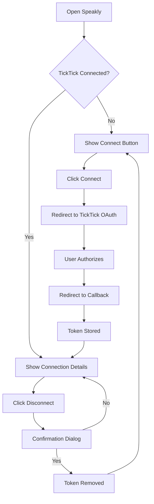

# TickTick Frontend Integration

## ✅ Implementation Complete!

The TickTick connection UI has been successfully added to the Speakly frontend.

---

## 📦 What Was Added:

### **1. API Client Functions** (`frontend/src/api.ts`)

**New Types:**
```typescript
interface TickTickStatusResponse {
  connected: boolean;
  user_id: number;
  expires_at?: string;
  scope?: string;
  error?: string;
}

interface TickTickProject {
  id: string;
  name: string;
}
```

**New Functions:**
- `getTickTickStatus()` - Check if TickTick is connected
- `connectTickTick()` - Redirect to OAuth flow
- `disconnectTickTick()` - Disconnect integration
- `getTickTickProjects()` - Fetch user's projects/lists

---

### **2. TickTick Connect Component** (`frontend/src/components/TickTickConnect.tsx`)

**Features:**
- ✅ Real-time connection status display
- ✅ "Connect TickTick" button for OAuth flow
- ✅ "Disconnect" button with confirmation
- ✅ Token expiration date display
- ✅ Permissions scope display
- ✅ Benefits list for disconnected state
- ✅ Error handling and loading states

**Component Structure:**
```tsx
<TickTickConnect>
  - Loads connection status on mount
  - Shows "Connected" badge with token info
  - Shows "Not Connected" badge with benefits
  - Connect button redirects to OAuth
  - Disconnect button with confirmation
</TickTickConnect>
```

---

### **3. Component Styling** (`frontend/src/components/TickTickConnect.css`)

**Design Features:**
- 🎨 Dark gradient background with gold accent
- 🎨 Status badges (Connected: teal, Disconnected: gold)
- 🎨 Smooth hover effects and transitions
- 🎨 Responsive design (mobile-friendly)
- 🎨 Modern card layout with glassmorphism

**Color Palette:**
- Gold gradient: `#f4d03f` → `#d4af37`
- Connected: Teal `#2dd4bf`
- Background: Dark `#141414` → `#0a0a0a`

---

### **4. App Layout Updates** (`frontend/src/App.tsx`)

**New Structure:**
```tsx
<app-container>
  <app-header>
    🎙️ Speakly
    Voice-to-Task Intelligence
  </app-header>
  
  <TickTickConnect />
  
  <AudioUploader />
</app-container>
```

**Added Header:**
- Large gradient title
- Subtitle tagline
- Gold accent styling

---

## 🎨 UI Preview

### **Not Connected State:**
```
┌─────────────────────────────────────┐
│  🎯 TickTick Integration            │
│  Automatically sync extracted TODOs │
│                                     │
│  ○ Not Connected                    │
│                                     │
│  Benefits:                          │
│  • Auto-sync extracted TODOs        │
│  • Keep tasks organized             │
│  • Never miss an action item        │
│                                     │
│  [Connect TickTick]                 │
└─────────────────────────────────────┘
```

### **Connected State:**
```
┌─────────────────────────────────────┐
│  🎯 TickTick Integration            │
│  Automatically sync extracted TODOs │
│                                     │
│  ✓ Connected                        │
│                                     │
│  User ID: 1                         │
│  Token Expires: Mar 30, 2025        │
│  Permissions: tasks:write tasks:read│
│                                     │
│  [Disconnect TickTick]              │
└─────────────────────────────────────┘
```

---

## 🚀 Testing the UI

### **1. Start the Application:**
```bash
podman compose up backend frontend
```

### **2. Open Browser:**
```
http://localhost:5173
```

### **3. You Should See:**
- Speakly header with gold gradient
- TickTick Integration card (not connected)
- Audio uploader below

### **4. Click "Connect TickTick":**
- Browser redirects to TickTick OAuth
- Login to TickTick
- Authorize Speakly
- Redirected back to app
- Status updates to "Connected" ✓

---

## 🔄 User Flow



---

## 📱 Responsive Design

**Desktop (>640px):**
- Full width card with padding
- Side-by-side info rows
- Fixed button width

**Mobile (<640px):**
- Reduced padding
- Stacked info rows
- Full-width button

---

## 🎯 Next Steps (Future Enhancements)

1. **Auto-refresh on callback** - Automatically refresh status after OAuth
2. **Project selector** - Dropdown to choose default project
3. **Sync status indicator** - Show when TODOs are being synced
4. **Sync history** - Display recently synced TODOs
5. **Manual sync button** - Force sync all pending TODOs
6. **Settings panel** - Advanced TickTick preferences

---

## 🔒 Security Notes

- OAuth flow uses secure HTTPS (in production)
- Tokens stored server-side only
- Frontend only displays connection status
- No sensitive data exposed in UI

---

## 📂 Files Created/Modified

**Created:**
- `frontend/src/components/TickTickConnect.tsx` - Main component
- `frontend/src/components/TickTickConnect.css` - Styling
- `docs/TICKTICK_FRONTEND.md` - This document

**Modified:**
- `frontend/src/api.ts` - Added TickTick API functions
- `frontend/src/App.tsx` - Added component and header
- `frontend/src/App.css` - Added header styles

---

**Beautiful, functional, ready to use! 🎨✨**
